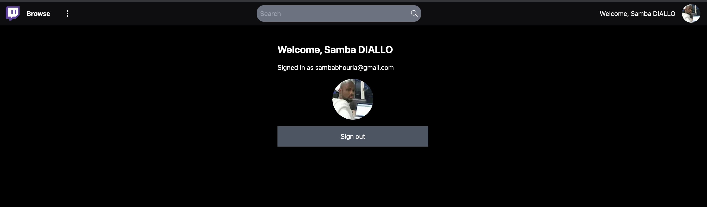
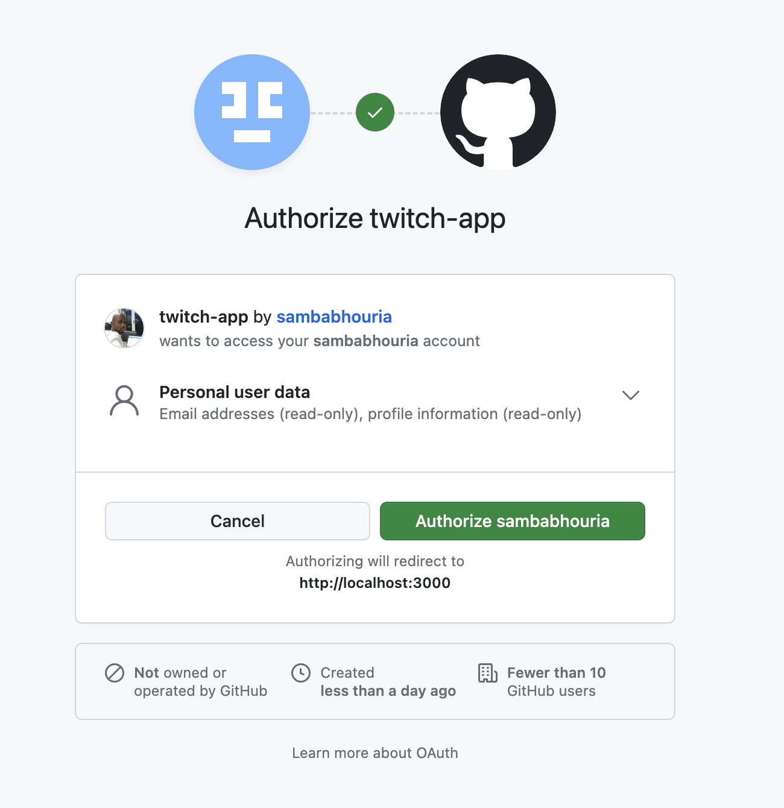
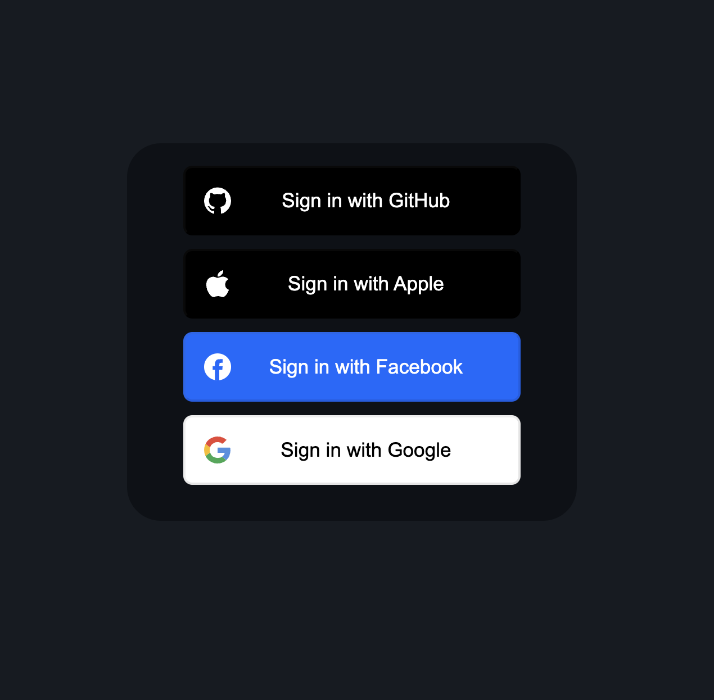

# Build Twitch with Next JS and Tailwind CSS _Bonus NextAuth.js_

Twitch in Next.JS with Tailwind CSS and as a bonus we will even add NextAuth.js for authentication using Github & Google! .
Learn the Next.JS routing and the Image component as we take advantage of lazy loading images!
using some mock data from https://mockaroo.com and utilizing Headless UI!

# Deploy

🌏 ![demo] :()

# What I Practice

🏆 Build Twitch UI with Next.JS
🏆 NextAuth.js web app authentication
🏆 Headless UI Component
🏆 Create a fully responsive web app in Next.JS styled with Tailwind CSS
🏆 Lazy loading images with the Image component
🏆 Statically imported images & external URL loaded images
🏆 Routing in Next.js

💻 Screen shot 💻

