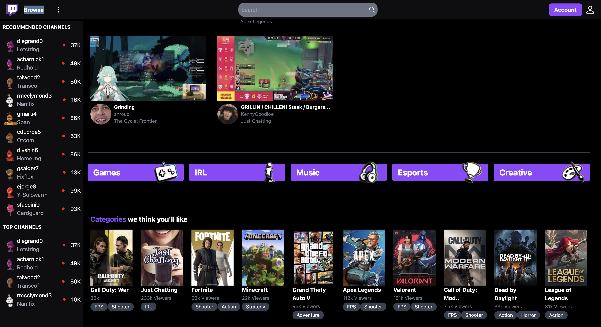
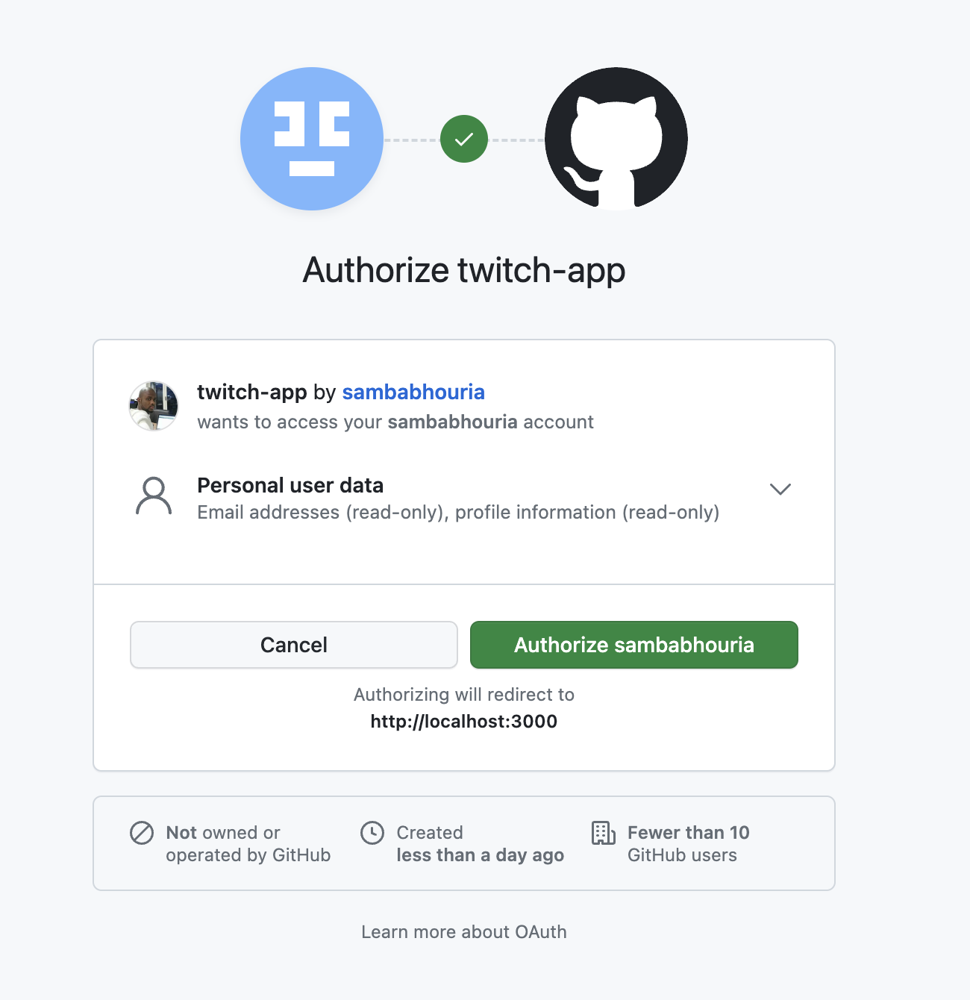

# Build Twitch with Next JS and Tailwind CSS _Bonus NextAuth.js_(Github & Google, Facebook,Apple)

Learn the Next.JS routing and the Image component as we take advantage of lazy loading images!
using some mock data from https://mockaroo.com and utilizing Headless UI!

# Deploy

🌠![demo] :()

# What I Practice

🆠Build Twitch UI with Next.JS
🆠NextAuth.js web app authentication
🆠Headless UI Component
🆠Create a fully responsive web app in Next.JS styled with Tailwind CSS
🆠Lazy loading images with the Image component
🆠Statically imported images & external URL loaded images
🆠Routing in Next.js

💻 Screen shot 💻

